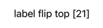
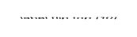
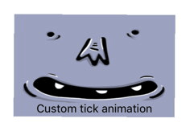
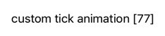

# RxAnimated - animated bindings

[](https://travis-ci.org/icanzilb/RxAnimated)
[](http://cocoapods.org/pods/RxAnimated)
[](http://cocoapods.org/pods/RxAnimated)
[](http://cocoapods.org/pods/RxAnimated)

**RxAnimated** provides animation interface to RxCocoa's bindings.

It comes with few predefined animation bindings, and provides a flexible mechanism for you to add your own predefined animations and use them when binding with RxCocoa.

## Usage

## Built-in animations

When binding values with RxCocoa you write something like:

```swift
textObservable
  .bind(to: labelFlip.rx.text)
```



This updates the label's text each time the observable emits a new string value. But this happens abruptly and without any transition. With RxAnimated you can use the `animated` extension to **bind values with animations**, like so:

```swift
textObservable
  .bind(animated: labelFlip.rx.animated.flip(.top, duration: 0.33).text)
```



The "difference" is that you use `bind(animated:)` instead of `bind(to:)` and you insert `animated.flip(.top, duration: 0.33)` (or one of the other provided or custom animation methods) between `rx` and the property sink you want to use, e.g. `text` in the example above.

The same built-in fade and flip animations work on any `UIView` element. And also on specific properties like `UILabel.rx.text` or `UIImageView.rx.image`.

### Animation List

List of built-in animated sinks:

```swift
UIView.rx.animated...isHidden
UIView.rx.animated...alpha
UILabel.rx.animated...text
UILabel.rx.animated...attributedText
UIControl.rx.animated...isEnabled
UIControl.rx.animated...isSelected
UIButton.rx.animated...title
UIButton.rx.animated...image
UIButton.rx.animated...backgroundImage
UIImageView.rx.animated...image
NSLayoutConstraint.rx.animated...constant
NSLayoutConstraint.rx.animated...isActive
```

List of the built-in animations:

```swift
UIView.rx.animated.fade(duration: TimeInterval)
UIView.rx.animated.flip(FlipDirection, duration: TimeInterval)
UIView.rx.animated.tick(FlipDirection, duration: TimeInterval)
UIView.rx.animated.animation(duration: TimeInterval, animations: ()->Void)
NSLayoutConstraint.rx.animated.layout(duration: TimeInterval)
```

Check the demo app for a number of examples.

## Custom animations

You can easily add your custom bind animations to match the visual style of your app.

I. (Optional) If you are animating a new binding sink that has no animated binding (e.g. `UIImageView.rx.image`, `UILabel.rx.text` and more are already included but you need another property)


```swift
// This is your class `UILabel`
extension AnimatedSink where Base: UILabel { 
    // This is your property name `text` and value type `String`
    public var text: Binder<String> { 
        let animation = self.type!
        return Binder(self.base) { label, text in
            animation.animate(view: label, block: {
                guard let label = label as? UILabel else { return }
                // Here you update the property
                label.text = text 
            })
        }
    }
}
```

II. Add your new animation method:

```swift
// This is your class `UIView`
extension AnimatedSink where Base: UIView { 
    // This is your animation name `tick`
    public func tick(_ direction: FlipDirection = .right, duration: TimeInterval) -> AnimatedSink<Base> { 
        // use one of the animation types and provide `setup` and `animation` blocks
        let type = AnimationType<Base>(type: RxAnimationType.spring(damping: 0.33, velocity: 0), duration: duration, setup: { view in
            view.alpha = 0
            view.transform = CGAffineTransform(rotationAngle: direction == .right ?  -0.3 : 0.3)
        }, animations: { view in
            view.alpha = 1
            view.transform = CGAffineTransform.identity
        })
        
        //return AnimatedSink
        return AnimatedSink<Base>(base: self.base, type: type) 
    }
}
```

III. Now you can use your new animation to bind subscriptions. Here's how usually binding `UIImageView.rx.image` looks like:

```swift
imageObservable
    .bind(to: imageView.rx.image)
```
And the result is non-animated binding:


If you use your new custom animation binding like so:

```swift
imageObservable
    .bind(to: imageView.rx.animated.tick(.right, duration: 0.33).image)
```

The effect will be:



And if you use the same animation on a `UILabel`:

```swift
textObservable
    .bind(to: labelCustom.rx.animated.tick(.left, duration: 0.75).text)
```



The sky is the limit! (And good taste.)

## Example

The demo app shows few animations in action, download the repo and give it a try.

## Installation

RxAnimated depends on RxSwift 5+.

RxAnimated is available through [CocoaPods](http://cocoapods.org). To install it, simply add the following line to your Podfile:

```ruby
pod "RxAnimated"
```

## License

RxAnimated is available under the MIT license. See the LICENSE file for more info.
